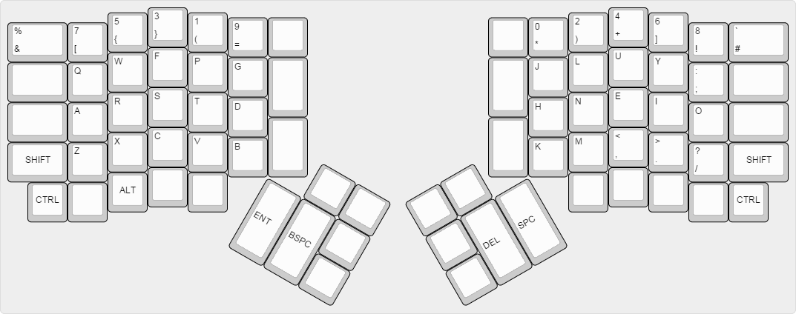
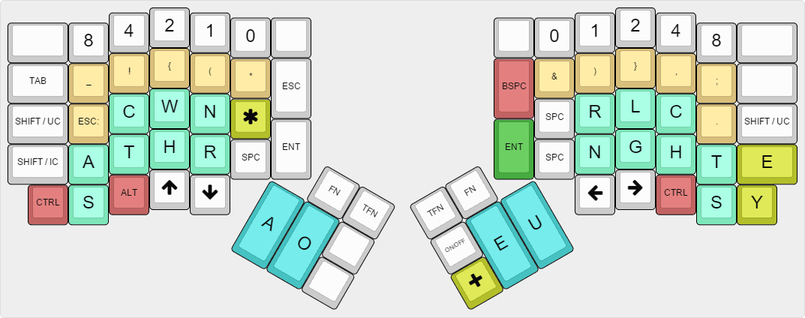

# Custom Programmer Colemak and Programmer Steno configuration

It's a firmware-implemented custom Programmer Colemak layout and a firmware-implemented custom Programmer Steno layout (inspired by the Jackdaw steno theory https://sites.google.com/site/ploverdoc/jackdaw)

## Programmer Colemak layout

(Inspired by the Programmer Dvorak layout : http://www.kaufmann.no/roland/dvorak/)

## Programmer Steno layout

### Lookup table for the left hand

    A               =       A                   [1]
    S               =       S                   [2]
    C               =       C                   [4]
    T               =       T                   [8]
    W               =       W                   [16]
    H               =       H                   [32]
    N               =       N                   [64]
    R               =       R                   [128]
    S|C             =       SC                  [6]
    S|T             =       ST                  [10]
    S|W             =       SW                  [18]
    S|H             =       SH                  [34]
    S|N             =       SN                  [66]
    S|R             =       SER                 [130]
    C|T             =       D                   [12]
    C|W             =       P                   [20]
    C|H             =       CH                  [36]
    C|N             =       Z                   [68]
    C|R             =       CR                  [132]
    T|W             =       TW                  [24]
    T|H             =       TH                  [40]
    T|N             =       V                   [72]
    T|R             =       TR                  [136]
    W|H             =       WH                  [48]
    W|N             =       M                   [80]
    W|R             =       WR                  [144]
    H|N             =       Y                   [96]
    H|R             =       RH                  [160]
    N|R             =       L                   [192]
    S|C|T           =       G                   [14]
    S|C|W           =       SP                  [22]
    S|C|H           =       SCH                 [38]
    S|C|N           =       SS                  [70]
    S|C|R           =       SCR                 [134]
    S|T|W           =       X                   [26]
    S|T|N           =       SV                  [74]
    S|T|R           =       STR                 [138]
    S|W|N           =       SM                  [82]
    S|H|N           =       SY                  [98]
    S|H|R           =       SHR                 [162]
    S|N|R           =       SL                  [194]
    C|T|W           =       DW                  [28]
    C|T|H           =       F                   [44]
    C|T|N           =       DEV                 [76]
    C|T|R           =       DR                  [140]
    C|W|H           =       PH                  [52]
    C|W|N           =       PN                  [84]
    C|W|R           =       PR                  [148]
    C|H|N           =       CY                  [100]
    C|H|R           =       CHR                 [164]
    C|N|R           =       CL                  [196]
    T|W|H           =       K                   [56]
    T|W|N           =       J                   [88]
    T|H|N           =       TY                  [104]
    T|H|R           =       THR                 [168]
    T|N|R           =       Q                   [200]
    W|H|N           =       MY                  [112]
    W|N|R           =       MR                  [208]
    H|N|R           =       LY                  [224]
    S|C|T|W         =       GW                  [30]
    S|C|T|H         =       GH                  [46]
    S|C|T|N         =       GN                  [78]
    S|C|T|R         =       GR                  [142]
    S|C|W|H         =       SPH                 [54]
    S|C|W|R         =       SPR                 [150]
    S|T|W|H         =       SK                  [58]
    S|T|W|R         =       XR                  [154]
    S|T|H|N         =       STY                 [106]
    S|T|N|R         =       SQ                  [202]
    S|H|N|R         =       SLY                 [226]
    C|T|W|H         =       B                   [60]
    C|T|W|N         =       DEM                 [92]
    C|T|W|R         =       DER                 [156]
    C|T|H|N         =       DY                  [108]
    C|T|H|R         =       FR                  [172]
    C|T|N|R         =       DEL                 [204]
    C|W|H|N         =       PY                  [116]
    C|W|H|R         =       PHR                 [180]
    C|W|N|R         =       PL                  [212]
    C|H|N|R         =       CRY                 [228]
    T|W|H|N         =       KN                  [120]
    T|W|H|R         =       KR                  [184]
    T|W|N|R         =       JER                 [216]
    T|H|N|R         =       TRY                 [232]
    S|C|T|H|N       =       GY                  [110]
    S|C|T|N|R       =       GL                  [206]
    S|C|W|H|N       =       SPY                 [118]
    S|C|W|N|R       =       SPL                 [214]
    S|T|W|H|N       =       XY                  [122]
    S|T|W|N|R       =       SERV                [218]
    S|T|H|N|R       =       STRY                [234]
    C|T|W|H|N       =       BY                  [124]
    C|T|W|H|R       =       BR                  [188]
    C|T|H|N|R       =       FL                  [236]
    C|W|H|N|R       =       PHL                 [244]
    T|W|H|N|R       =       KL                  [248]
    C|T|W|H|N|R     =       BL                  [252]
    A|S             =       AS                  [3]
    A|C             =       AC                  [5]
    A|T             =       AT                  [9]
    A|W             =       AW                  [17]
    A|H             =       AH                  [33]
    A|N             =       AN                  [65]
    A|R             =       AR                  [129]
    A|S|C           =       ASC                 [7]
    A|S|T           =       AST                 [11]
    A|S|H           =       ASH                 [35]
    A|S|N           =       ANN                 [67]
    A|S|R           =       ARR                 [131]
    A|C|T           =       AD                  [13]
    A|C|W           =       AP                  [21]
    A|C|H           =       ACH                 [37]
    A|C|N           =       AZ                  [69]
    A|C|R           =       ACR                 [133]
    A|T|W           =       ATT                 [25]
    A|T|H           =       ATH                 [41]
    A|T|N           =       AV                  [73]
    A|T|R           =       ATR                 [137]
    A|W|H           =       AWH                 [49]
    A|W|N           =       AM                  [81]
    A|H|N           =       AY                  [97]
    A|N|R           =       AL                  [193]
    A|S|C|T         =       AG                  [15]
    A|S|C|W         =       ASP                 [23]
    A|S|C|N         =       ASS                 [71]
    A|S|C|R         =       ASCR                [135]
    A|S|T|W         =       AX                  [27]
    A|S|T|H         =       ASTH                [43]
    A|S|W|N         =       ASM                 [83]
    A|S|H|N         =       ASY                 [99]
    A|S|N|R         =       ASL                 [195]
    A|C|T|W         =       ADD                 [29]
    A|C|T|H         =       AF                  [45]
    A|C|T|N         =       ADV                 [77]
    A|C|T|R         =       ADR                 [141]
    A|C|W|H         =       APH                 [53]
    A|C|W|N         =       AMM                 [85]
    A|C|W|R         =       APR                 [149]
    A|C|H|N         =       ACC                 [101]
    A|C|H|R         =       ACCR                [165]
    A|T|W|H         =       AK                  [57]
    A|T|W|N         =       AJ                  [89]
    A|T|W|R         =       ATTR                [153]
    A|T|N|R         =       AQ                  [201]
    A|W|N|R         =       ALL                 [209]
    A|S|C|T|W       =       AGG                 [31]
    A|S|C|T|H       =       AGH                 [47]
    A|S|C|T|N       =       AGN                 [79]
    A|S|C|T|R       =       AGR                 [143]
    A|S|C|W|H       =       ASPH                [55]
    A|S|C|W|N       =       APP                 [87]
    A|S|C|W|R       =       APPR                [151]
    A|S|T|W|H       =       ASK                 [59]
    A|S|T|N|R       =       ASQ                 [203]
    A|C|T|W|H       =       AB                  [61]
    A|C|T|W|N       =       ADM                 [93]
    A|C|T|W|R       =       ADDR                [157]
    A|C|T|H|N       =       AFF                 [109]
    A|C|T|H|R       =       AFR                 [173]
    A|C|T|N|R       =       ACQ                 [205]
    A|C|W|H|R       =       APHR                [181]
    A|C|W|N|R       =       APL                 [213]
    A|C|H|N|R       =       ACCL                [229]
    A|T|W|H|N       =       ACKN                [121]
    A|T|H|H|R       =       ATHL                [169]
    A|S|C|T|W|H     =       ABB                 [63]
    A|S|C|T|W|N     =       ADJ                 [95]
    A|S|C|T|W|R     =       AGGR                [159]
    A|S|C|T|H|N     =       AFT                 [111]
    A|S|C|T|H|R     =       AFFR                [175]
    A|S|C|T|N|R     =       AGL                 [207]
    A|S|C|W|H|N     =       ASPHY               [119]
    A|S|C|W|N|R     =       APPL                [215]
    A|C|T|W|H|N     =       ABY                 [125]
    A|C|T|W|H|R     =       ABR                 [189]
    A|C|T|W|N|R     =       ADDL                [221]
    A|C|T|H|N|R     =       AFL                 [237]
    A|S|C|T|W|H|R   =       ABBR                [191]
    A|S|C|T|W|N|R   =       AGGL                [223]
    A|S|C|T|H|N|R   =       AFFL                [239]
    A|C|T|W|H|N|R   =       ABL                 [253]

### Lookup table for thumbs 

    A               =       A                   [1]
    O               =       O                   [2]
    E               =       E                   [4]
    U               =       U                   [8]
    A|O             =       IO                  [3]
    A|E             =       EA                  [5]
    A|U             =       AU                  [9]
    O|E             =       IE                  [6]
    O|U             =       OU                  [10]
    E|U             =       I                   [12]
    A|O|E           =       EE                  [7]
    A|O|U           =       OO                  [11]
    A|E|U           =       AI                  [13]
    O|E|U           =       OI                  [14]

### Lookup table for the right hand

    R               =       R                   [1]
    N               =       N                   [2]
    L               =       L                   [4]
    G               =       G                   [8]
    C               =       C                   [16]
    H               =       H                   [32]
    T               =       T                   [64]
    S               =       S                   [128]
    R|N             =       RN                  [3]
    R|L             =       RL                  [5]
    R|G             =       RG                  [9]
    R|C             =       RC                  [17]
    R|H             =       W                   [33]
    R|T             =       RT                  [65]
    R|S             =       RS                  [129]
    N|L             =       S                   [6]
    N|G             =       NG                  [10]
    N|C             =       NC                  [18]
    N|H             =       V                   [34]
    N|T             =       NT                  [66]
    N|S             =       NS                  [130]
    L|G             =       LG                  [12]
    L|C             =       P                   [20]
    L|H             =       Z                   [36]
    L|T             =       LT                  [68]
    L|S             =       LS                  [132]
    G|C             =       B                   [24]
    G|H             =       GH                  [40]
    G|T             =       K                   [72]
    G|S             =       GS                  [136]
    C|H             =       CH                  [48]
    C|T             =       CT                  [80]
    C|S             =       CS                  [144]
    H|T             =       TH                  [96]
    H|S             =       HS                  [160]
    T|S             =       TS                  [192]
    R|N|L           =       LL                  [7]
    R|N|G           =       GN                  [11]
    R|N|H           =       WN                  [35]
    R|N|T           =       RNT                 [67]
    R|N|S           =       RNS                 [131]
    R|L|C           =       RP                  [21]
    R|L|H           =       WL                  [37]
    R|L|S           =       RLS                 [133]
    R|G|C           =       RB                  [25]
    R|G|H           =       RGH                 [41]
    R|G|T           =       RK                  [73]
    R|G|S           =       RGS                 [137]
    R|C|H           =       RCH                 [49]
    R|C|S           =       RCS                 [145]
    R|H|T           =       RTH                 [97]
    R|H|S           =       WS                  [161]
    R|T|S           =       RTS                 [193]
    N|L|G           =       D                   [14]
    N|L|C           =       SP                  [22]
    N|L|H           =       SH                  [38]
    N|L|T           =       ST                  [70]
    N|L|S           =       SS                  [134]
    N|G|C           =       GG                  [26]
    N|G|H           =       M                   [42]
    N|G|T           =       NK                  [74]
    N|G|S           =       NGS                 [138]
    N|C|H           =       NCH                 [50]
    N|C|T           =       TION                [82]
    N|C|S           =       NCES                [146]
    N|H|T           =       NTH                 [98]
    N|H|S           =       VES                 [162]
    N|T|S           =       NTS                 [194]
    L|G|C           =       BL                  [28]
    L|G|H           =       X                   [44]
    L|G|T           =       KL                  [76]
    L|C|H           =       PH                  [52]
    L|C|T           =       PT                  [84]
    L|C|S           =       PS                  [148]
    L|H|T           =       LTH                 [100]
    L|H|S           =       ZES                 [164]
    L|T|S           =       LTS                 [196]
    G|C|H           =       F                   [56]
    G|C|T           =       CK                  [88]
    G|C|S           =       BS                  [152]
    G|H|T           =       GHT                 [104]
    G|H|S           =       GHS                 [168]
    G|T|S           =       KS                  [200]
    C|H|T           =       TCH                 [112]
    C|H|S           =       D                   [176]
    C|T|S           =       CTS                 [208]
    H|T|S           =       THS                 [224]
    R|N|L|G         =       DL                  [15]
    R|N|L|C         =       PL                  [23]
    R|N|L|H         =       LV                  [39]
    R|N|L|T         =       RST                 [71]
    R|N|L|S         =       LLS                 [135]
    R|N|G|H         =       RM                  [43]
    R|N|G|S         =       GNS                 [139]
    R|N|C|H         =       RV                  [51]
    R|N|H|T         =       WTH                 [99]
    R|N|H|S         =       WNS                 [163]
    R|L|C|S         =       RPS                 [149]
    R|L|H|S         =       WLS                 [165]
    R|G|C|H         =       RF                  [57]
    R|G|C|S         =       RBS                 [153]
    R|G|H|T         =       WK                  [105]
    R|G|T|S         =       RKS                 [201]
    R|C|H|S         =       RD                  [177]
    R|H|T|S         =       RTHS                [225]
    N|L|G|H         =       SM                  [46]
    N|L|G|T         =       SK                  [78]
    N|L|G|S         =       DS                  [142]
    N|L|C|T         =       NST                 [86]
    N|L|C|S         =       SPS                 [150]
    N|L|H|S         =       SHES                [166]
    N|L|T|S         =       STS                 [198]
    N|G|C|H         =       MB                  [58]
    N|G|C|T         =       BT                  [90]
    N|G|C|S         =       GGS                 [154]
    N|G|T|H         =       NGTH                [106]
    N|G|H|S         =       MS                  [170]
    N|G|T|S         =       NKS                 [202]
    N|C|H|S         =       ND                  [178]
    N|H|T|S         =       NTHS                [226]
    L|G|C|H         =       LF                  [60]
    L|G|C|T         =       CKL                 [92]
    L|G|C|S         =       BLES                [156]
    L|G|H|T         =       XT                  [108]
    L|G|H|S         =       XES                 [172]
    L|C|H|T         =       PTH                 [116]
    L|C|H|S         =       PHS                 [180]
    G|C|H|T         =       FT                  [120]
    G|C|H|S         =       DG                  [184]
    G|C|T|S         =       CKS                 [216]
    G|H|T|S         =       GHTS                [232]
    C|H|T|S         =       DS                  [240]
    R|N|L|G|C       =       LB                  [31]
    R|N|L|G|H       =       LM                  [47]
    R|N|L|G|T       =       LK                  [79]
    R|N|L|C|H       =       LCH                 [55]
    R|N|L|C|T       =       LP                  [87]
    R|N|L|C|S       =       PLES                [151]
    R|N|L|H|S       =       LVES                [167]
    R|N|L|T|S       =       RSTS                [199]
    R|N|G|H|S       =       RMS                 [171]
    R|N|C|H|S       =       WD                  [179]
    R|N|H|T|S       =       WTHS                [227]
    R|L|G|H|S       =       RLD                 [173]
    R|G|H|T|S       =       WKS                 [233]
    R|C|H|T|S       =       RDS                 [241]
    N|L|G|C|H       =       MP                  [62]
    N|L|G|H|T       =       DTH                 [110]
    N|L|G|H|S       =       SMS                 [174]
    N|L|G|T|S       =       SKS                 [206]
    N|G|C|H|S       =       MBS                 [186]
    N|G|C|T|S       =       BTS                 [218]
    N|G|H|T|S       =       NGTHS               [234]
    N|C|H|T|S       =       NDS                 [242]
    L|G|C|T|S       =       CKLES               [220]
    L|C|H|T|S       =       PTHS                [244]
    R|N|L|G|C|S     =       LBS                 [159]
    R|N|L|G|H|S     =       LMS                 [175]
    R|N|L|G|T|S     =       LKS                 [207]
    R|N|L|C|T|S     =       LPS                 [215]
    R|N|C|H|T|S     =       WDS                 [243]
    R|L|C|H|T|S     =       RLDS                [245]
    N|L|G|C|H|T     =       MPT                 [126]
    N|L|G|C|H|S     =       MPS                 [190]
    N|L|G|H|T|S     =       DTHS                [238]
    R|N|L|C|H|T|S   =       LDS                 [247]
    N|L|G|C|H|T|S   =       MPTS                [254]

### Lookup table for right E and Y

    E               =       E                   [1]
    Y               =       Y                   [2]
    E|Y             =       EY                  [3]

### Lookup table for left user symbols

    0               =       :                   [1]
    1               =       _                   [2]
    2               =       !                   [4]
    3               =       {                   [8]
    4               =       (                   [16]
    5               =       *                   [32]

### Lookup table for right user symbols

    0               =       &                   [1]
    1               =       )                   [2]
    2               =       }                   [4]
    3               =       ,                   [8]
    4               =       ;                   [16]
    5               =       .                   [32]
