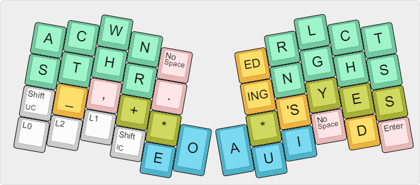
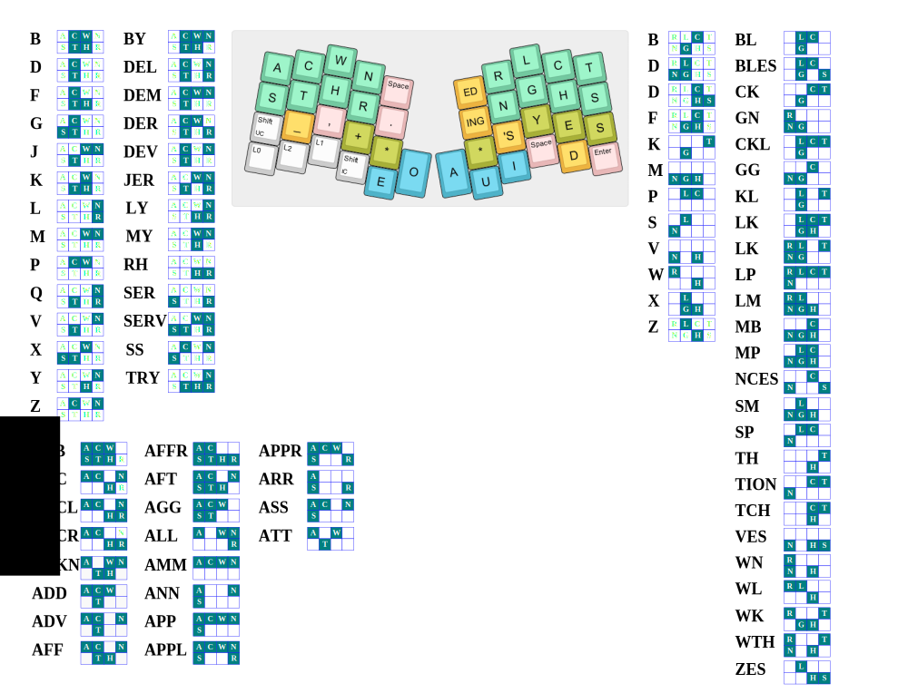

## Summary

This implements layers for the [Atreus](https://atreus.technomancy.us/) keyboard. It uses dual-use keys liberally, and it includes a chording/steno layout based on [Jackdaw](https://sites.google.com/site/ploverdoc/jackdaw). 

## Main layer

## Symbol/numpad layer

## Fn/movement layer

The TEENSY key (RESET) is define in this layer

## Steno layer (experimental)

This was derived from the great work by Vissale Neang (GitHub user FromtonRouge) on his [Ergodox
layout](https://github.com/FromtonRouge/qmk_firmware/tree/master/keyboard/ergodox_ez/keymaps/fromtonrouge).
See that page for more information on key combinations.

Here is a cheat sheet with some of the nonobvious [Shelton chords](http://www.google.com/patents/US3970185) included ([pdf](jackdaw-cheatsheet.pdf)).

