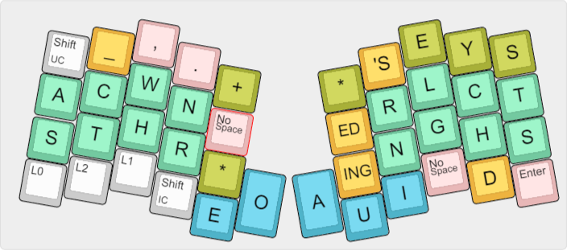

## Summary

This implements layers for the [Atreus](https://atreus.technomancy.us/) keyboard. It uses dual-use keys liberally, and it includes a chording/steno layout based on [Jackdaw](https://sites.google.com/site/ploverdoc/jackdaw). 

## Main layer

## Symbol/numpad layer

## Fn/movement layer

The TEENSY key (RESET) is define in this layer

## Steno layer (experimental)

This was derived from the great work by Vissale Neang (GitHub user FromtonRouge) on his [Ergodox
layout](https://github.com/FromtonRouge/qmk_firmware/tree/master/keyboard/ergodox_ez/keymaps/fromtonrouge).
See that page for more complete information on key combinations. 
Jackdaw was developed mainly by [Jennifer Brien](https://groups.google.com/forum/?fromgroups#!topic/ploversteno/C42uhF0P8WI). 

Here is a cheat sheet with some of the nonobvious [Shelton chords](http://www.google.com/patents/US3970185) included ([pdf](jackdaw-cheatsheet.pdf)).

This layer includes a "No-Space" key similar to that in a Veyboard/Velotype. This reduces use relative to a space key. The logic with this implementation is:

* Normal chords produce a trailing space. 
* If a new chord involves more the one family (e.g. left family and a vowel), it is entered normally. 
* If a new chord is within one family (e.g. just vowels), the trailing space from the previous chord is removed, as the new chord is appended. 
* No-Space by itself: if there is a trailing space in the previous chord, remove it, otherwise, add a space.
* If the No-Space key is included in a chord, it reverses the two actions above. So, a chord involving multiple families is appended, and a chord within a family is kept separate. 
* No-Space with the * key toggles the trailing space on the previous chord.